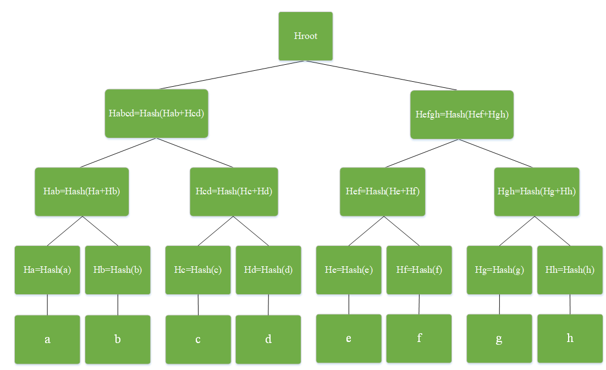

# Plonky3和Binius中的Brakedown多项式承诺协议解析及优化

## 1. Introduction

多项式承诺方案是一种密码协议，它允许一方（证明者）承诺一个多项式，而不透露其系数，并在之后向另一方（验证者）证明该多项式在特定点处计算出的值为某个特定值，而不透露有关该多项式的任何其他信息。在各种零知识证明系统中，多项式承诺都是不可缺少的重要组成部分。多项式承诺方案的发展在很大程度上决定了零知识证明系统的更新迭代进程。FRI <a href="#ref1">1</a>(基于哈希函数)、KZG<a href="#ref2">1</a>和Bulletproof <a href="#ref3">1</a>(基于椭圆曲线)是当前最为常见的多项式承诺协议。Plonky(2019年)最初使用的是KZG多项式承诺，Plonky2(2022年)参考了STARK的设计加入了FRI多项式承诺协议，Plonky3(2024年)中又增加了Brakedown多项式承诺协议。

KZG多项式承诺在椭圆曲线上实现，其优点是应用于单变量多项式时，验证成本很低，然而Prover 的大部分工作都会涉及到大量的FFT（产生多项式）和MSM（产生多项式承诺）计算，因此证明的计算速度很慢。FRI多项式承诺是基于哈希函数的，没有椭圆曲线的MSM运算，通过运用递归思想运算效率得到提升，它在证明者成本和验证者成本之间可以进行权衡，这取决于协议中使用的Reed-Solomon码率[4]。Brakedown[5]多项式承诺仍然使用了哈希函数，并结合纠错码理论使它比FRI更快，但是证明要大得多。相比与KZG多项式承诺，FRI和Brakedown证明速度有很大优势，而且是量子安全的，但是这两者不具备同态隐藏性质，限制了在某些场景中的应用。

2021年Alexander Golovnev等人提出了Brakedown多项式承诺方案，它参考了[6]中的线性时间编码实现和[7]中的Spartan线性时间交互式证明系统设计。Brakedown被认为是当下最快的多项式承诺协议，因此Orion[8]和Binius[9][10]都参考了此方案，而且在最新的Plonky3中也加入了Brakedown，它的主要缺点是Proof Size较大。

## 2. Preliminaries
Brakedown多项式承诺方案由线性时间编码多项式承诺方案（linear-time commitment scheme）演化而来，主要是使用Expander Graph对线性时间编码部分做了改进，它的主要技术组成如下图所示。

Figure 1 Brakedown技术组成

### 2.1 张量（tensor）与张量积
在数学中，张量可以理解为一个多重线性映射，即将若干个线性空间 映射到域 上的映射。不同阶数（dimensionality）的张量与其他数据类型的关系如下：

* 标量（0 阶张量）： 单个数值。

* 向量（1 阶张量）： 一维数组。

* 矩阵（2 阶张量）： 二维数组。

* 更高阶张量： 三维或更高维的数组，例如彩色图像 (每个像素包含 RGB 三个值)。

张量的积有很多种，如外积、内积、直积、Kronecker Product等，我们在这里只介绍直积（通常称为张量积），描述为：两个任意阶张量，第一个张量的每一个分量乘以第二个张量中的每一个分量，它们组合的集合仍然是一个张量，称为第一个张量乘以第二个张量的直积。直积的阶数等于因子张量阶数之和。下面是一个直观的例子：
$$\left[\begin{matrix}a_1\\a_2\end{matrix}\right]\otimes\left[\begin{matrix}b_1&b_2&b_3\end{matrix}\right]=
\left[\begin{matrix}a_1b_1&a_1b_2&a_1b_3\\a_2b1&a_2b_2&a_2b_3\end{matrix}\right]
$$
通常说的张量积就是直积，张量积具有扩充向量维度的作用，上式中两个一维向量扩充为二维矩阵，在ZK里面用到的就是张量直积，即将多项式系数组成的方阵分解为两个向量的张量积，如下式：
$$
\left[\begin{matrix}a_1b_1&a_1b_2&a_1b_3\\a_2b1&a_2b_2&a_2b_3\\a_3b1&a_3b_2&a_3b_3\end{matrix}\right]=\left[\begin{matrix}a_1\\a_2\\a_3\end{matrix}\right]\otimes\left[\begin{matrix}b_1&b_2&b_3\end{matrix}\right]=\mathbf{a}\otimes\mathbf{b}
$$

### 2.2 Error Correcting Code and Linear Code
纠错码是一种用于控制数据传输或存储过程中错误的技术。它通过在原始数据中添加冗余信息来实现错误检测和纠正，从而确保数据的完整性和可靠性，在通信领域有着广泛的应用，主要工作过程包括：编码(Encoding)、传输/存储、解码(Decoding)和数据恢复。其中重复码是纠错码的一个简单例子，其编码原理是将每个数据位发送3次，解码时以重复次数较多的数位为准，具体如下表。重复码最多纠正一位错误位，或两位丢失位。

Table 1 重复码编码解码过程

<table border="2" align="center">
	<tr>
		<th align="center" width="20%">传输数据</th>
		<th align="center" width="20%">编码</th>
        <th align="center" width="20%">接收的码字</th>
        <th align="center" width="20%">解码</th>
	</tr>
	<tr>
		<td rowspan="4" align="center">0</td>
		<td rowspan="4" align="center">000</td>
		<td align="center">000</td>
        <td rowspan="4" align="center">0</td>
	</tr>
	<tr>
		<td align="center">001</td>
	</tr>
	<tr>
		<td align="center">010</td>
	</tr>
	<tr>
		<td align="center">100</td>
	</tr>
    	<tr>
		<td rowspan="4" align="center">1</td>
		<td rowspan="4" align="center">111</td>
		<td align="center">111</td>
        <td rowspan="4" align="center">1</td>
	</tr>
	<tr>
		<td align="center">110</td>
	</tr>
	<tr>
		<td align="center">101</td>
	</tr>
	<tr>
		<td align="center">011</td>
	</tr>
</table>

纠错码中的一个重要分支是线性码，它利用线性代数原理来检测和纠正数据传输或存储过程中出现的错误。它的一个重要性质就是线性码中的码字可以通过对信息位进行线性组合得到。这意味着，任意两个码字的线性组合仍然是一个码字，这对多项式承诺的批量处理非常有用。线性码的几个基本参数包括：

* ***码字 (Code word)***: 线性码中的每个有效编码元素都被称为码字。码字是由信息符号经过编码得到的。

* ***码长 (Code length)***: 码字中的符号数量。

* ***信息位 (Message bits)***: 原始信息中包含的位数。

* ***校验位 (Parity bits)***: 添加到信息位中用于错误检测和纠正的额外位数。

* ***码率 (Code rate)***: 信息位与码字长度的比率，表示编码效率。
* ***汉明距离(Hamming distance)***：两个等长码字对应位置的不同字符的个数。

下面两种线性码均均可用到零知识证明系统中：

$\blacktriangle$ ***BCH码***：BCH 码使用了有限域和多项式计算。为了检测错误可以构建一个检测多项式，这样接收端就可以检测是否有错误发生。BCH编码的基本思想是：假如消息是$m(x)$，然后乘上一个编码多项式$p(x)$，得到码字$m(x)p(x)$。由于码字发送过程中会会受到很多干扰，于是多项式被加上错误多项式$e(x)$，而接收者的消息为$c(x)$，就有
$$c(x)=m(x)p(x)+c(x)$$
接收者事先和发送者约定了$p(x)$，只要让$c(x)$除以$p(x)$，如果余项是0，即没有受到干扰，那么商就是$m(x)$，就是正确的消息。其中$p(x)$必须是本原多项式(primitive polynomials)，而且一个本原多项式只能纠正一个错误，错误的位置根据余项$e(x)$来确定。

$\blacktriangle$***Reed-Solomon码***：Reed-Solomon码为BCH码的子集。它使用的本原多项式称为Generator多项式，即
$$p(x)=(x-\alpha^0)p(x-\alpha^1)\cdots (x-\alpha^{2t-1})$$
由于Reed-Solomon编码也是执行再有限域上，这里的 $\alpha$表示有限域的生成元。所以编码为：
$$c(x)=m(x)p(x)$$
其中，$m(x)$长度为$k$，$p(x)$长度为$l=2t$，码字$c(x)$长度为$n=l+k$。
例如$m(x)$的$k$个值为$[m_0,m_1,\cdots,m_{k-1}]$，以这些值构成的多项式为:
$$m(x)=\sum_{i=0}^{k-1}m_i x^i$$
则Reed-Solomon编码为:
$$c(x)=m(x)x^m-((m(x)x^m) \mod p(x))$$
这里，$((m(x)x^m) \mod p(x))$的degree小于等于$m-1$，$c(x)$的degree小于等于$n-1$。即$c(x)$有以下形式：
$$c(x)=\sum_{i=0}^{n-1}c_i x^i$$
所以编码后的码字为$[c_0,c_1,\cdots,c_{n-1}]$。
### 2.3 哈希函数（Hash Function）
哈希函数是将输入数据打乱混合，重新创建一个叫做散列值/哈希值的指纹。散列值通常用一个短的随机字母和数字组成的字符串来代表，数学表示如下：
$$H_m=Hash(m)$$
其中，$m$表示任意长度消息(不同算法实现，长度限制不同)；$Hash$是一些列的排列和数学计算集合构成的哈希函数；$H_m$是输出固定长度的哈希值。

哈希函数的特点是：
* *单向性：如果两个散列值是不相同的，那么这两个散列值的原始输入也是不相同的，并且很难由输出推算出原始输入。
* 散列碰撞（collision）：散列函数的输入和输出不是唯一对应关系的，如果两个散列值相同，两个输入值很可能是相同的，但也可能不同。
* 防篡改：输入的数据稍微产生改变就会产生一个完全不同的散列值。

**ZK系统的进化目标之一就是寻找计算友好的抗碰撞哈希函数**，目前比较常见的哈希算法有SHA256、Keccak、Blake3、Poseidon2、Poseidon3（前面的文章做过详细介绍）的等。

### 2.4默克尔树（Merkle Tree）
默克尔树是一种树形数据结构，在零知识证明中主要使用的是二叉树结构，每个叶节点是数据块的哈希，除了叶节点以外的节点是其子节点的哈希。默克尔树的主要优点是能够高效、安全地验证大型数据结构的内容。

在区块链中，默克尔树被用来归纳一个区块中的所有交易，同时生成整个交易集合的数字指纹，且提供了一种校验区块是否存在某交易的有效效途径。生成一棵完整的Merkle树需要递归地对哈希节点对进行哈希，并将新生成的哈希节点插入到Merkle树中，直到只剩一个哈希节点，该节点就是默克尔树的根。 具体如下所示:

Figure 2 默克尔树的结构

默克尔树是区块链技术的基础。第一，在区块链里，所有交易都按照默克尔树的格式组织起来，再与区块头（Block Header）对应起来，就可以保证本区块交易信息的不可篡改。第二，在默克尔树中，只要任一叶节点发生变化，根哈希都会变，这样可以很容易地在大量数据中找出哪些数据发生了变化，整个数据验证过程非常高效。第三，利用哈希函数的单向性可以构建零知识证明系统，仅通过部分节点的验证即可实现多项式承诺，而无需透露具体内容。第四，默克尔树用于POW共识算法，主要操作就是给定一定的数据，然后寻找其他的数据，合并起来计算出来的根哈希值小于某个值（通常说的挖矿），目前的比特币、以太坊，都是使用的POW共识。
## 3. Breakdown Commitment
### 3.1 Linear Codes Polynomial Commitments
Breakown的基础就是使用线性码构建多项式承诺，优点在于证明大小和验证时间复杂度都是长度的平方根。

下面给出一个简单的线性码多项式承诺过程。假设多项式$g$的系数向量的长度为$n$，并且可以使用填充0的方式扩充到$d=k^2$且$d \geq n$。因此有:
$$\begin{aligned}
g(x)&=a_0+a_1x+a_2x^2+\cdots+a_{d-1}x^{d-1}=\sum_{i=0}^{d-1}a_ix^i\\
&=[1,x,x^2,\cdots,x^{k-1}]\left[\begin{matrix}b_{1,1}&b_{1,2}&\cdots &b_{1,k}\\b_{2,1}&b_{2,2}&\cdots &b_{2,k}\\ \vdots &\vdots&\ddots &\vdots\\b_{k,1}&b_{k,2}&\cdots &b_{k,k}\end{matrix}\right]\left[\begin{matrix}1\\x^k\\ x^{2k}\\ \vdots\\x^{(k-1)k}\end{matrix}\right]\\
&=\sum_{p=1}^{k}\sum_{q=1}^{k}b_{p,q}x^{(p-1)+(q-1)k}
\end{aligned}$$
通过上式，把长度为$d=k^2$的多项式系数转化为$k$阶方阵$\mathbf{B}$，我们希望仅需构造一个证明大小为行数$k=\sqrt{d}$的多项式承诺就可等价于原长度为$d$的多项式承诺，要实现这一点还需要借助线性纠错码(如上小节介绍的Linear-Time Encoding)和Merkle树。

首先，使用线性纠错码对方阵$\mathbf{B}$的每一行编码，记为$\mathbf{Enc}(\mathbf{B}_i)$，将其扩展为$k\times m$的矩阵$\mathbf{C}$，其中$l$为码字长度(这里为了确保
$l$不会太大，所以一般采用码率为常数的编码方式)。
$$\left[\begin{matrix}b_{1,1}&b_{1,2}&\cdots &b_{1,k}\\b_{2,1}&b_{2,2}&\cdots &b_{2,k}\\ \vdots &\vdots&\ddots &\vdots\\b_{k,1}&b_{k,2}&\cdots &b_{k,k}\end{matrix}\right]\stackrel{Linear Codes}{\Longrightarrow} \left[\begin{matrix}c_{1,1}&c_{1,2}&\cdots &c_{1,m}\\c_{2,1}&c_{2,2}&\cdots &c_{2,m}\\ \vdots &\vdots&\ddots &\vdots\\c_{k,1}&c_{k,2}&\cdots &c_{k,m}\end{matrix}\right]
$$
然后，对矩阵的每一列($k$个值)进行承诺并建立第一个Merkle树，并以每一列Merkle树的根哈希作为叶子节点(共$l$个)建立第二个Merkle树。最后，基于第二个Merkle树来构建多项式承诺即可。

在取值证明的计算中，需要完成两步，一是Proximity Test，二是Consistency Test。Proximity Test保证了需要检查 Merkle Tree所承诺的矩阵确实承诺了$k=\sqrt{d}$个码字。Consistency Test保证原来的求值点向量 与原始矩阵的乘积与结果向量之间的一致性。

***Proximity Test*** :Verifier向Prover发送一个长度为$k$的随机向量$r=[r_1,r_2,\cdots，r_k]$，之后Prover计算这个随机向量与方阵$\mathbf{B}$的乘积，得到一个长度为$k$的目标向量$u$（$u$相当于是方阵$\mathbf{B}$在向量$r$下的随即线性组合），Prover 将$u$返回给 Verifier，Verifier 收到$u$后，需要检查其与承诺值$\hat{u}=[\hat{u}_1,\hat{u}_2,\cdots,\hat{u}_m]$的一致性（$\hat{u}_i$表示编码后矩阵$\mathbf{C}$的第$i(0\leq i \leq m)$列）。

首先,Verifier对$u$进行编码，得到$\mathbf{Enc}(u')$，然后,Verifier根据$r$和$\hat{u}$计算一个向量$\nu$ 
$$\nu=\sum_{i=1}^{k}{r_i\cdot\hat{u}_i}$$
 
然后Verifier选择$\mathbf{Enc}(u')$中$l$个（$l=\Theta(\lambda)$ 个）随机点，检查这些点是否都与向量$\nu$对应位置的值相等，若均相等，则Proximity Test通过，这里用到了线性码的基本性质：码字之间的任意线性组合仍然是一个码字。

***Consistency Test***：该步骤和Proximity Test的工作差不多，只不过将随机向量$r$替换为一个特定向量$\mathbf{q}_1$。接下来看如何获得$\mathbf{q}_1$。

首先多项式取值可以表示为系数矩阵与坐标矩阵的内积：
$$\begin{aligned}
g(x)&=a_0+a_1x+a_2x^2+\cdots+a_{d-1}x^{d-1}\\
&=\langle\mathbf{X},\mathbf{B}\rangle\\
&=\Bigg\langle\left[\begin{matrix}x^{0}&x^{1}&\cdots &x^{k-1}\\x^{k}&x^{k+1}&\cdots &x^{2k-1}\\ \vdots &\vdots&\ddots &\vdots\\x^{(k-1)k}&x^{(k-1)k+1}&\cdots &x^{k^2-1}\end{matrix}\right],\left[\begin{matrix}b_{1,1}&b_{1,2}&\cdots &b_{1,k}\\b_{2,1}&b_{2,2}&\cdots &b_{2,k}\\ \vdots &\vdots&\ddots &\vdots\\b_{k,1}&b_{k,2}&\cdots &b_{k,k}\end{matrix}\right]\Bigg\rangle\\
\end{aligned}$$

 
在上式中，方阵$\mathbf{X}$可以表示为两个长度为$k$的向量$\mathbf{q}_1$和$\mathbf{q}_2$的张量积，所以有：
$$\begin{aligned}
g(x)=\langle\mathbf{q}_1\otimes\mathbf{q}_2,\mathbf{B} \rangle\end{aligned}$$
 
也就是说，对于多项式的的任意输入$q$，均存在两个向量$\mathbf{q}_1$和$\mathbf{q}_2$，使得$\begin{aligned}
g(q)=\langle\mathbf{q}_1\otimes\mathbf{q}_2,\mathbf{B} \rangle\end{aligned}$。

在Consistency Test阶段就是用$\mathbf{q}_1$替换Proximity Test中的$r$，$\mathbf{q}_1$与方阵$\mathbf{B}$的相乘得到$u''$，这个步骤中，如果Prover是诚实的，则$u''$必然满足：
$$\langle u'',\mathbf{q}_2 \rangle=\langle \mathbf{q}_1 \otimes\mathbf{q}_2,\mathbf{B} \rangle$$

否则测试不通过。完整的承诺方案如下所示。

------
**Commit:**
* *P → V: a commit vector $\hat{u} = (\hat{u}_1, ..., \hat{u}_m) \in \mathbf{F}^m$. If P is honest, each "row" $\hat{u}_i$ of $\hat{u}$ contains a codeword in $\mathbf{Enc}$*.

**Proximity Test:**

* *V → P: a random vector $r \in \mathbf{F}^k$*.
* *P → V: a vector $u' \in \mathbf{F}^k$. claimed to equal $v = \sum_{i=1}^k r_i \cdot u_i \in \mathbf{F}^k$.*
* // *Now V probabilistically checks consistency between $\hat{u}$ and $u'$ (V reads the entirety of $\hat{u}$).*
* V: *chooses $Q$ to be a random set of size $l = \Theta(\lambda)$ . For each $j \in Q$:*
- *V queries all $m$ entries of the corresponding "column" of $\hat{u}$, namely $\hat{u}_{1,j}, ..., \hat{u}_{m,j}$.*
- *V confirms $\mathbf{En}c(u')_j = \sum_{i=1}^m r \cdot \hat{u}_{i,j}$, halting and rejecting if not.* 
  
**Consistency Test**
* *Let $\mathbf{q}_1, \mathbf{q}_2 \in \mathbf{F}^k$ such that $g(x) = ((\mathbf{q}_1 \otimes \mathbf{q}_2), \mathbf{B})$.*
* *The evaluation phase is identical to the testing phase except that $r$ is replaced with $\mathbf{q}_1$ (and fresh randomness is used to choose a set $Q'$ of columns for use in consistency testing).*
* *If all consistency tests pass, then V outputs $(u'', \mathbf{q}_2)$ as $g(x)$.*
------
### 3.2 Expander Graph and Linear-Time Encodable Linear Code
线性时间编码是线性纠错码的一种，核心是扩展图（Expander Graph），如下图所示：

Figure 3 Expander Graph

Expander Graph是一种具有强连通性的稀疏图，用$G_{n,m,d}$表示，其中$n$为左边Message节点的个数，$m$为右边Codeword节点的个数，$d$为每个左边顶点链接右边节点的个数，如上图可写为$G_{6,9,3}$。这种编码方式是线性码，可以用一个$n$行$m$列的生成矩阵$\mathbf{M}_{n,m,d}$来表示(矩阵的每一行有$d$个非零元素)，而且这个编码方式可以在线性时间内完成，因为左侧的每个信源符号都与有限$d$个码元符号相关，因此编码的时间为信源符号数量的常数$d$倍。

设置一组参数：$0<\alpha<1$，$0<\beta<\frac{\alpha}{1.28}$，$r\geq \frac{1+2\beta}{1-\alpha}> 1$，$c_n\geq 3$，$d_n\geq 3$，[5]给出了Expander Graph的线性时间编码过程：

这里，
$$\begin{aligned}
c_n=&\Bigg\lceil \min \Big(\max(1.28\beta n,\beta n+4),\\ 
&\frac{1}{\beta \log_2{\frac{\alpha}{1.28\beta}}}\big( \frac{110}{n}+ H(\beta)+\alpha H(\frac{1.28\beta}{\alpha})\big) \Big)\Bigg\rceil
\end{aligned}$$

$$\begin{aligned}
d_n=&\Bigg\lceil \min \Big( \big( 2\beta+\frac{(r-1)+110/n}{\log_2q}\big)n,D\Big)\Bigg\rceil
\end{aligned}$$

$$\begin{aligned}
D=\max\Bigg(&\frac{r\alpha H(\beta /r)+\mu H(\nu /\mu)+110/n}{\alpha \beta \log_2{\frac{\mu}{\nu}}},\\
&\frac{r\alpha H(\beta /(r\alpha))+\mu H((2\beta+0.03)/\mu)+110/n}{\beta \log_2{\frac{\mu}{2\beta+0.03}}},\\
&(2\beta+0.03)\Big(\frac{1}{\alpha r-\beta}+\frac{1}{\alpha \beta}+\frac{1}{\mu -2\beta -0.03}\Big)+1
\Bigg)
\end{aligned}$$

其中，$H(x)=-x\log_2x-(1-x)\log_2(1-x)$表示二进制熵函数（binary entropy function），$\mu =r-1-r\alpha$,$\nu =\beta +\alpha \beta +0.03$。

编码算法是一个递归的过程，目的是构造一个线性映射$\mathbf{Enc}_n:\mathbb{F^n}\rightarrow\mathbb{F^{rn}}$，即对于任意长度为$n$的域向量$x$映射到一个长度为$rn$的域向量$\omega$。码字$\omega$由三部分组成，分别是$x$，$z$，$\nu$ (前$n$位与信息相同)，码率为$1/r$，码字距离为固定值$\gamma = \beta /r$。算法中有两个Expander Graph生成矩阵，分别是$\mathbf{M}_{n,\alpha n,c_n}$和$\mathbf{M}_{\alpha rn,(r-1-r\alpha)n,d_n}$。算法示意图如下。

Figure 4 基于Expander Graph的线性时间编码

线性时间编码是递归进行的，需要设置一个边界条件结束递归进程，在Brakedown中当信息元的长度小于30 的时候就可以终止递归。

Brakedown无需透明设置，承诺和 Prover Time为$O(d)$，与多项式大小呈线性阶，而且很有可能满足后量子安全性，唯一的缺点是证明的大小比较大，达到了$O(d)$。 

当然Brakedown是一种成长型承诺方案，既能用于单变量多项式承诺，也可用于multilinear多项式承诺方案中，随着新的哈希函数和新的纠错码的开发，它在未来还有很大的优化空间。

## 4. Breakdown的优化
由以上分析可知，Breakdown多项式承诺的唯一缺点是证明的大小较大，因此，Breakdown的优化方向是如何减少证明的大小。已有的手段包括：

* ①*Proximity Test和Consistency Test可以并行执行，并且可以使用相同的查询数据进行测试和评估，或者直接省略Proximity Test；*

* ②*改变多项式系数的排列方式(Ligero[11]采用的方法)，即多项式的系数不必排列为方阵，可以根据实际编码方式和查询方式适当调整行列比例。这种优化可以显著减少证明大小。*

除了上述优化方向，本文考虑了另外一种优化思路：扩展多项式系数矩阵的维度空间，并使用二维张量积来表示多项式取值（待开发）。

References：

[1]https://drops.dagstuhl.de/storage/00lipics/lipics-vol107-icalp2018/LIPIcs.ICALP.2018.14/LIPIcs.ICALP.2018.14.pdf

[2]	Kate, A., Zaverucha, G.M., Goldberg, I.. Constant-Size Commitments to Polynomials and Their Applications. International Conference on the Theory and Application of Cryptology and Information Security, 2010.

[3]	https://doc-internal.dalek.rs/bulletproofs/notes/inner_product_proof/i ndex.html

[4]	Ulrich Haböck. A summary on the fri low degree test. Cryptology ePrint Archive, Paper 2022/1216, 2022.

[5]	https://eprint.iacr.org/2021/1043.pdf?ref=hackernoon.com

[6]	J. Bootle, A. Chiesa, and J. Groth. Linear-time arguments with sub-linear verification from tensor codes. In TCC, 2020.

[7]	S. Setty. Spartan: Efficient and general-purpose zkSNARKs without trusted setup. In CRYPTO, 2020.

[8]	T. Xie, Y. Zhang, and D. Song, “Orion: Zero knowledge proof with linear prover time,” Cryptology ePrint Archive, Paper 2022/1010, 2022, https://eprint.iacr.org/2022/1010.

[9]	B. Diamond, J. Posen,“Succinct Arguments over Towers of Binary Fields,” Cryptology ePrint Archive, Paper 2023/1784, 2023,  https://eprint.iacr.org/2023/1784.pdf

[10]	https://github.com/IrreducibleOSS/binius

[11]	S. Ames, C. Hazay, Y. Ishai, and M. Venkitasubramaniam. Ligero: Lightweight sublinear arguments without a trusted setup. In CCS, 2017
